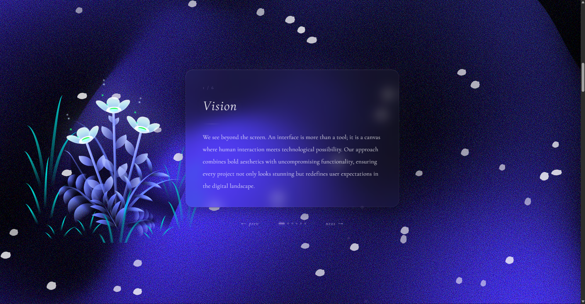
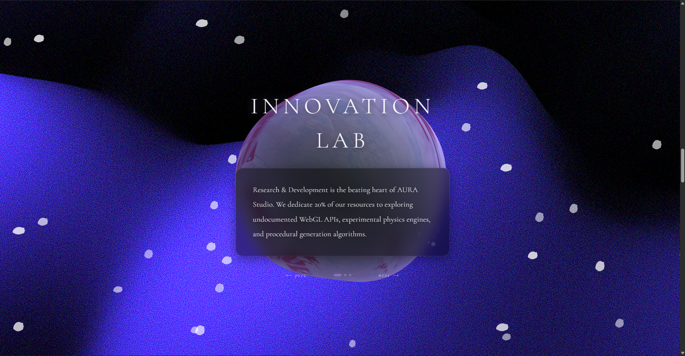
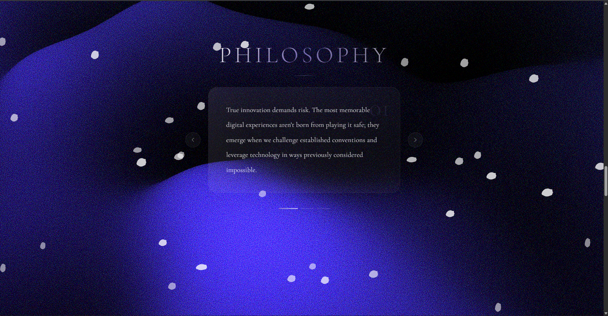
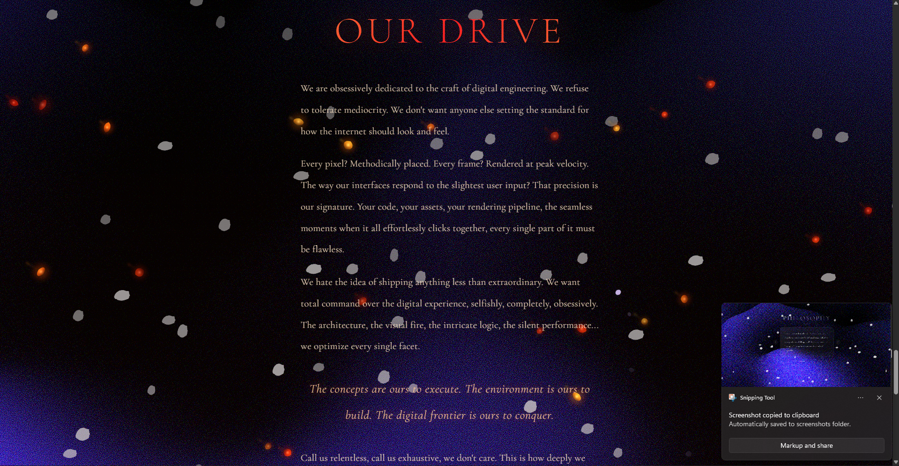
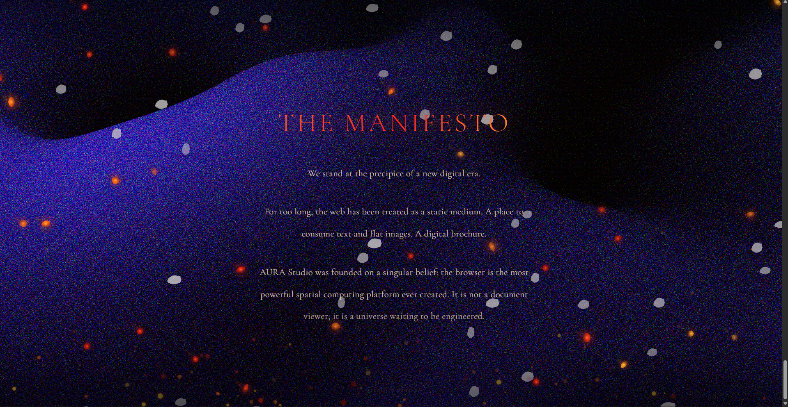

# Animated Website - Project Documentation

This repository contains a multi-section immersive website built with React + Vite. It combines shader-based backgrounds, Three.js rendering, multiple canvas particle systems, audio playback, and scroll-driven storytelling.

## Demo Visuals

Screenshots are stored in `docs/demo-visuals/` for quick preview:









## What This Website Does

The page is a long-form scroll experience with 9 major sections:

1. Intro hero with word-by-word text reveal and mouse-based 3D tilt.
2. Audio initialization section that starts/stops looping background music (`/public/song.mp3`).
3. Card carousel with 6 themed content cards.
4. Mission/statement section with styled text blocks.
5. "INNOVATION LAB" section with a live Three.js blob using custom vertex + fragment shaders.
6. "PHILOSOPHY" section with a second card system and progress indicators.
7. Capability/poetry list with reveal animations.
8. "OUR DRIVE" fire scene with flame particles and burning petals.
9. "THE MANIFESTO" section with click-to-start, auto-scroll text, manual-scroll override, and visibility-triggered second audio (`/public/les.mp3`).

## Technical Implementation Summary

### App Shell and Orchestration

- `src/main.jsx` mounts React app.
- `src/App.jsx` controls global composition and scroll flow:
  - Places fixed layered backgrounds/overlays.
  - Tracks mouse movement for text tilt.
  - Tracks scroll progress to fade/scatter flower overlay.
  - Handles primary audio toggle (`song.mp3`).
  - Starts manifesto audio (`les.mp3`) when the final section becomes visible.

### Visual Layers

- Shader background: `@shadergradient/react` inside `ShaderGradientCanvas`.
- Ambient petals: `src/Petals.jsx` (canvas, image-based drifting petals).
- Flower scene: `src/Flowers.jsx` + `src/Flowers.scss` (pure CSS/SCSS animation system).
- Cursor FX: `src/CursorPetals.jsx` (trail + burst particles on move/click/drag, mouse + touch).

### Section Components

- `src/BlobSection.jsx`
  - Creates Three.js scene, camera, lights, and WebGL renderer.
  - Uses custom GLSL shaders to animate a morphing sphere with texture tint/fresnel lighting.
  - Includes local card navigation (prev/next/dots).

- `src/MotivationSection.jsx`
  - Card slider with arrow controls and clickable progress bars.

- `src/JealousySection.jsx`
  - Canvas-based fire particles with additive blending.
  - Uses `src/BurningPetals.jsx` overlay for ember-like petal particles.

- `src/LetterSection.jsx`
  - Reuses fire + burning petals concept.
  - Starts as title-only; clicking title starts auto-scrolling text.
  - Manual wheel/touch scroll pauses auto-scroll and resumes after 3 seconds.
  - Uses `IntersectionObserver` to call parent callback when section is visible.
  - Text content is externalized in `src/letterContent.js`.

### Styling and UX Rules

- `src/App.css` and section CSS files provide layout, typography, glow, glassmorphism, and responsive behavior.
- Global `user-select: none` is enabled for all elements.
- Particle canvases use `pointer-events: none` so core UI remains clickable.

## Dependencies Used

Main runtime dependencies from `package.json`:

- `react`, `react-dom`
- `vite`
- `three`
- `@shadergradient/react`
- `@react-three/fiber`, `@react-spring/three`, `three-stdlib`, `camera-controls`

Dev dependencies include ESLint tooling, React plugin for Vite, and `sass` for SCSS support.

## How to Run This Website Locally

### Prerequisites

- Node.js 18+ (recommended current LTS)
- npm (bundled with Node.js)

### Install and Run

```bash
npm install
npm run dev
```

Then open the local URL shown in terminal (typically `http://localhost:5173`).

### Build for Production

```bash
npm run build
npm run preview
```

## How to Push This Project to Your GitHub

If this folder is not yet connected to a remote repository:

```bash
git init
git add .
git commit -m "Initial commit"
git branch -M main
git remote add origin https://github.com/YOUR_USERNAME/YOUR_REPO.git
git push -u origin main
```

If remote is already set and you only want to push latest changes:

```bash
git add .
git commit -m "Update README with project documentation"
git push
```

## Useful Scripts

- `npm run dev` - start development server
- `npm run build` - production build
- `npm run preview` - preview production build locally
- `npm run lint` - run ESLint
